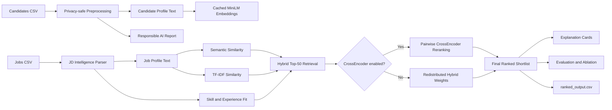

# TalentRank AI

> **Explainable AI Candidate Discovery Engine**

TalentRank AI helps recruiters turn a job description and a candidate pool into an explainable, ranked shortlist. It combines rule-based job intelligence, semantic retrieval, keyword relevance, structured fit signals, and optional CrossEncoder reranking—while explicitly excluding sensitive personal attributes from ranking.

## Problem statement

Recruiters often receive more applications than they can review deeply. Traditional applicant-tracking workflows rely heavily on keyword filters, which can miss semantically relevant candidates, over-rank shallow keyword matches, and make shortlist decisions difficult to explain or audit.

The challenge is to rank candidates against a role using evidence that is both more meaningful than keyword counts and transparent enough for recruiters to review.

## Our solution

TalentRank AI builds a recruiter decision-support workflow:

- Parses the job description into role, seniority, skills, responsibilities, domain, and experience requirements.
- Creates privacy-safe candidate and job profiles from approved ranking fields.
- Retrieves candidates using TF-IDF and Sentence Transformers semantic similarity.
- Combines skill coverage, experience fit, activity, and optional CrossEncoder pairwise relevance into a final score.
- Generates explanation cards with strengths, gaps, evidence, and confidence.
- Exposes evaluation, ablation, responsible-AI, and export views in Streamlit.

> This system is a recruiter decision-support tool. Final hiring decisions should be human-reviewed.

## Architecture



## Tech stack

| Area | Technology |
| --- | --- |
| Language | Python 3.10+ |
| Data processing | pandas, NumPy |
| Lexical ranking | scikit-learn TF-IDF + cosine similarity |
| Semantic ranking | Sentence Transformers `all-MiniLM-L6-v2` |
| Optional reranking | Sentence Transformers CrossEncoder `cross-encoder/ms-marco-MiniLM-L-6-v2` |
| Dashboard | Streamlit |
| Testing | pytest |

## Project structure

```text
talentrank-ai/
├── app/
│   └── streamlit_app.py        # Seven-page hackathon dashboard
├── data/
│   ├── raw/                    # Input jobs and candidates CSV files
│   ├── processed/              # Cached candidate embeddings
│   └── outputs/                # Ranking, feature-use, and sample output files
├── src/
│   ├── jd_parser.py            # Rule-based JD intelligence and taxonomy
│   ├── preprocessing.py        # Privacy-safe profile text construction
│   ├── retrieval.py            # TF-IDF, embeddings, and CrossEncoder helpers
│   ├── explainability.py       # Structured candidate explanation cards
│   ├── fairness.py             # Sensitive-field exclusion and feature reports
│   ├── evaluation.py           # Metrics, diagnostics, and ablation analysis
│   ├── output_writer.py        # CSV, JSON, and audit-report writing
│   └── ...
├── tests/
├── run_pipeline.py
├── requirements.txt
├── SUBMISSION.md
└── demo_script.md
```

## Ranking methodology

1. **JD intelligence** extracts role title, seniority, must-have and nice-to-have skills, responsibilities, domain, and experience range.
2. **Candidate profile text** combines skills, projects, summary, education, and experience. Sensitive attributes are never added.
3. **Hybrid retrieval** scores the whole candidate pool and retains the top 50 candidates.
4. **Optional CrossEncoder reranking** scores job-candidate text pairs for the retained shortlist.
5. **Final ranking** adds structured skill, experience, and activity evidence.
6. **Explanation cards** make the ranking evidence and gaps reviewable.

### Scoring formula

Top-50 hybrid retrieval:

```text
hybrid_score = 0.45 × semantic_score + 0.35 × tfidf_score + 0.20 × skill_match_score
```

With CrossEncoder enabled:

```text
final_score =
  0.30 × cross_encoder_score +
  0.20 × skill_match_score +
  0.20 × semantic_score +
  0.15 × tfidf_score +
  0.10 × experience_match_score +
  0.05 × activity_score
```

When CrossEncoder is disabled, its 30% weight is split equally between semantic similarity and skill coverage.

## Explainability module

Each ranked candidate receives an explanation card with:

- Fit summary and confidence level
- Matched must-have and nice-to-have skills
- Missing required skills
- Experience, project, and activity evidence
- A clear risk or gap statement
- Component score breakdown

The Streamlit **Candidate Explanation** page presents this information for recruiter review.

## Responsible AI module

`src/fairness.py` explicitly excludes these fields from ranking:

`name`, `gender`, `religion`, `caste`, `age`, `date_of_birth`, `photo`, `marital_status`, `address`

Only skills, education, projects, summary, experience, and activity contribute to ranking. `candidate_id` and `job_id` are identifiers only. Each pipeline run writes `data/outputs/used_features_report.json` with the used features, detected sensitive fields, exclusions, and the decision-support disclaimer.

## Evaluation metrics

When relevance labels are available (`job_id`, `candidate_id`, `relevance`), TalentRank AI calculates:

- Precision@5
- Precision@10
- Recall@10
- NDCG@10
- MRR

Without labels, it reports average top-10 skill coverage, semantic score, experience match, and ranking latency. The **Evaluation** page also compares TF-IDF only, Semantic only, Hybrid, and Hybrid + CrossEncoder variants.

## Run locally

Prerequisites: Python 3.10+.

Clone the repo and move into the project folder first — every command below assumes your terminal is
already inside `talentrank-ai` (running them from your home folder will fail with "No such file or directory"):

```powershell
git clone https://github.com/pradyumna-naik/talentrank-ai.git
cd talentrank-ai
```

(Optional but recommended) create and activate a virtual environment so dependencies stay isolated:

```powershell
python -m venv .venv
.venv\Scripts\Activate.ps1
```

If PowerShell blocks the activation script with an execution-policy error, run
`Set-ExecutionPolicy -Scope Process -ExecutionPolicy Bypass` once, then retry.

Install dependencies and run the pipeline:

```powershell
python -m pip install -r requirements.txt
python run_pipeline.py
```

Start the dashboard:

```powershell
streamlit run app/streamlit_app.py
```

Enable the optional CrossEncoder stage:

```powershell
python run_pipeline.py --cross-encoder
```

The MiniLM model must be available in the local Hugging Face cache. The project downloads it on the initial setup run; later runs use the local cache and candidate embeddings are stored in `data/processed/candidate_embeddings.npy`.

Run tests:

```powershell
python -m pytest -q tests
```

## Output file format

`data/outputs/ranked_output.csv` has this delivery schema:

| Column | Description |
| --- | --- |
| `job_id` | Job identifier |
| `candidate_id` | Candidate identifier |
| `rank` | Rank within the job shortlist |
| `final_score` | Final evidence-weighted score on a 0–100 scale |
| `explanation` | Concise, recruiter-readable fit summary |

See [sample_ranked_output.csv](data/outputs/sample_ranked_output.csv) for an example.

## Limitations

- Sample data is small and does not represent production hiring data.
- Skill extraction is rule-based and depends on the current taxonomy and CSV quality.
- Scores are decision-support signals, not assessments of candidate potential or job performance.
- CrossEncoder reranking can add noticeable CPU latency.
- Unsupervised diagnostics do not establish real-world hiring quality; relevance labels are required for that.

## Future improvements

- Expand the skill ontology with role- and industry-specific aliases.
- Add multilingual resume and JD support.
- Add recruiter feedback loops and calibrated relevance-label collection.
- Support configurable score weights and fairness monitoring across cohorts where lawful and appropriate.
- Add vector-store retrieval for larger candidate pools.
- Add secure authentication, audit trails, and role-based access for production deployment.

## Screenshots

_Add dashboard screenshots here before final submission._

Suggested captures:

1. Home page with ranking controls and shortlist summary.
2. JD Intelligence page with parsed skills and responsibilities.
3. Candidate Explanation page with score breakdown.
4. Responsible AI and Evaluation pages.
